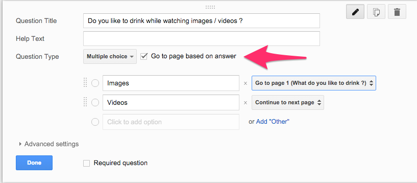

### Implementing conditionality in Google Forms

Conditionality in Google Forms is implemented by using pages and multiple choice question.
Based on our three pages setup before (page 1 : question, page 2 : images, page 3 : video), let set up a question in page 1 that determines wether or not the form will go to page 2 or page 3 depend on the answer.

- Create a multiple choice question "Do you like to drink while watching images or videos ?"
- If the answer is watching images then we will go to page 2
- If the answer is videos then we will go page 3
- Mark the option "go to pages based on the answer"
- Choose the page that you want each answer to go

### Exercise

One of the most common usage for using conditionality in a google form is to create a consent form

- Create another page in the front of the form
- Create another page after that, telling that because you have not given consent you cannot fill this form. It will then continue to the end of the form directly and skipping the questions.
- Add a multiple choice question "Do you give consent ?" with the answer Yes or No
- If yes, then continue to the question page
- If not, then skip to the next page that you have not given consent

Next: [Distributing Google Form](google-forms-05-distributing.html)

Prev: [Theming to Google Forms](google-forms-03-theming.html)

[Main menu](index.html)
