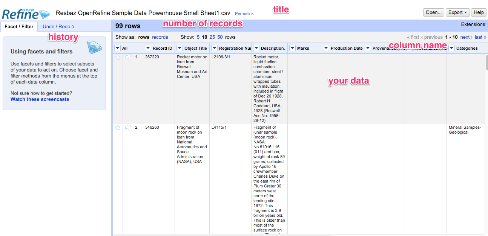

### The Open Refine Interface

You will see the Open Refine main interface once you load the project. This would be your main window when you work with Open Refine.

There are 3 areas that you should put your main attention to :

- the column name, this will be how you access the Open Refine functions
- your data, as it will show the data you are currently working with
- history, where you can see all the steps that you have done

### Basic Column Manipulation

You can click on the the individual arrow on the side of the column name to do column manipulation.

Some of the notable function are :

- Hiding column/collapse column
Means that we're hiding the column from view
How : click on arrow bar beside the column name, select view, and collapse column

- Rename column
Means that we rename the column
How : click on the arrow bar beside the column name, select edit column, rename column

- Reorder the column
Means that we reorder the column position
How : click on the arrow bar beside the all column name, select reorder column

- Change the data type in the column
Means that we change the data in the column to be a data type such as text or number
How : click on the arrow bar beside the column name, select edit cell, common transform, and select the format that you want

- Sorting the column
Means that we sort the contents of the column
However when doing sort we need to make note to make it "permanent"
How : click on the arrow bar beside the column name, select sort
to make permanent, see the sort text on top right, click on it and set make permanent

### Exercise

- hide the permanent link column
- remove the . (dot sign) from description column name
- reorder so that marks column is put on the back 
- change the data type of record id to be number
- make the sort permanent

### The history view

Open refine provides a very powerful history view where you can see every operation that you made using Open Refine
To access it, click on the Undo/Redo link on the top left.
You can click on any of the steps to undo/redo the steps.

You can also extract the operation you have as a json file that you can apply to other file as well

### Exporting

To export your data using Open Refine click on the export button in the top right
You will have many format to choose, including csv, tsv, xls, and many more options

### Exercise

- extract the json file and save it as a text file somewhere in your computer
- Undo all the steps
- export as excel
- create a new project from the excel
- apply the extracted json file

Next: [Using Facet for selection in Open Refine](open-refine-04-faceting.html)

Prev: [Open Refine Project Creation](open-refine-02-creation.html)

[Main menu](index.html)
